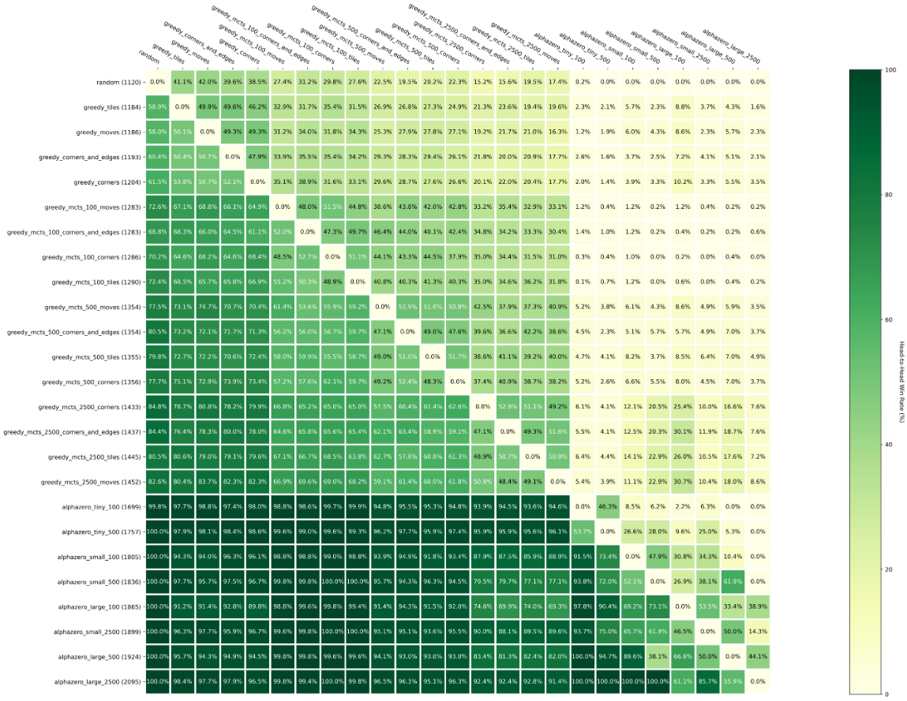

 
# TurboZero
The TurboZero project contains vectorized, hardware-accelerated implementations of AlphaZero-esque algorithms, alongside vectorized implementations of single-player and multi-player environments. Basic training infrastructure is also included, which means models can be trained for supported environments straight out of the box. This project is similar to DeepMind's [mctx](https://github.com/deepmind/mctx), but as of now is more focused on model-based algorithms like AlphaZero rather than model-free implementations such as MuZero, and is written with PyTorch instead of JAX. Due to this focus, TurboZero includes additional features relavant to model-based algorithms, such as persisting MCTS subtrees. I hope to eventually expand this project and implemented hardware-accelerated adaptations of other RL algorithms, like PPO, MuZero, etc.

This project has been a labor of love but is still a little rough around the edges. I've done my best to fully explain all configuration options in this file as well as in the [wiki](https://github.com/lowrollr/turbozero/wiki). The [wiki](https://github.com/lowrollr/turbozero/wiki) also provides notes on implementation and vectorization for each of the environments as well as Monte Carlo Tree Search. While as of writing this I believe the project is in a usable, useful state, I still intend to do a great deal of work expanding functionaltiy, fixing issues, and improving performance. I cannot garauntee that data models or workflows will not drastically change as the project matures.

## Motivation 
Training reinforcement learning algorithms is notoriously compute-intensive. Oftentimes models must train for millions of episodes to reach desired performance, with each episode containing many steps and each step requiring numerous model inference calls and dynamic game-tree exploration. All of these factors contribute to RL training tasks sometimes being prohibitvely expensive, even when taking advantage of process (CPU) parallelism. However, if environments and algorithms can be implemented as a set of multi-dimensional matrix operations, this computation can be offloaded to GPUs, reaping all the benefits of GPU parallelism by training on and evaluating stacked environments in parallel. TurboZero includes implementations of simulation environments and Rl algorithms that do just that.

While other common open-source implementations of AlphaZero complete training runs in days/weeks, TurboZero can complete similar tasks in minutes/hours when paired with the appropriate  hardware.

## Features
### Environments
TurboZero provides vectorized implementations of the following environments:
| Environment | Type | Observation Size | Policy Size | Description | 
| --- | --- | --- | --- | --- |
| Othello | Multi-Player |2x8x8 | 65 | 2-player tile-swapping game played on an 8x8 board. also called Reversi |
| 2048 | Single-Player |4x4 | 4 | Single-player numeric puzzle game |

Each environment supports the full-suite of training and evaluation tools, and are implemented with GPU-acceleration in mind. Links to the environment readmes are found above, which provide information on configuration options, implementation details, and results acheived.

### Training
TurboZero supports training policy/value models via the following vectorized algorithms:
| Name | Description | Hyperparameters | Paper |
| --- | --- | --- | --- |
| AlphaZero | DeepMind's algorithm that first famously defeated Lee Sodol in Go and has since been shown to generalize well to other games such as Chess and Shogi as well as more sophisticated tasks like code generation and video compression. | [dataclass](https://github.com/lowrollr/lazyzero/blob/main/core/evaluation/mcts_hypers.py) | [Silver, 2017](https://arxiv.org/abs/1712.01815)
| LazyZero | A lazy implementation of AlphaZero that only utilizes PUCT to dictate exploration at the root node. Exploration steps instead use fixed depth rollouts sampling from the trained model policy. I wrote this as a simpler, albeit worse alternative to AlphaZero, and showed it can effectively train models to play *2048* and win. | [dataclass](https://github.com/lowrollr/lazyzero/blob/main/core/evaluation/lazy_mcts_hypers.py) | | 

Training can be done in a Jupyter notebook, or via the command-line. In addition to environment parameters and training hyperparameters, the user may specify the number of environments to train in parallel, so that the user is able to optimize for their own hardware. See [Quickstart](https://github.com/lowrollr/turbozero#quickstart) for a quick guide on how to get started, or [Training](https://github.com/lowrollr/turbozero/wiki/Training) for full information on configurating your training run. I also provide example configurations that I have used to train effective models for each environment.  

### Evaluation
In addition to the algorithms supporting training a policy, TurboZero also provides vectorized implementations of the following algorithms that serve as baselines to evaluate against:
| Name | Description | Parameters | 
| --- | --- | --- | 
| [Greedy MCTS](https://github.com/lowrollr/turbozero/wiki/Evaluation-&-Testing#greedy-mcts) | MCTS using a heurisitc function to evaluate leaf nodes | [parameters](https://github.com/lowrollr/turbozero/wiki/Evaluation-&-Testing#parameters-2) |
| [Greedy](https://github.com/lowrollr/turbozero/wiki/Evaluation-&-Testing#greedy) | Evaluates potential actions using a heuristic function, no tree search | [parameters](https://github.com/lowrollr/turbozero/wiki/Evaluation-&-Testing#parameters-1)
| [Random](https://github.com/lowrollr/turbozero/wiki/Evaluation-&-Testing#random) | Makes a random legal move | [parameters](https://github.com/lowrollr/turbozero/wiki/Evaluation-&-Testing#parameters)

Evaluating against these algorithms can be baked into the evaluation step of a training run, or be run independently. See [Evaluation & Testing](https://github.com/lowrollr/turbozero/wiki/Evaluation-&-Testing) for the full configuration specification.

### Tournaments / Calculating Elo

Available for multi-player environments, tournaments provide a great way to gauge the relative strength of an algorithm in relation to various opponents. This allows the user to evaluate the effectiveness of adjusting parameters of an algorithm, or analyze how effective increasing the size of a neural network is in terms of performance. In addition, tournaments allow algorithms to be compared against a large cohort of baseline algorithms. Where applicable, I provide tournament data for each environment that will allow you to test your algorithms and models against a pre-populated field. Tournaments are simulated many times in order to generate accurate Elo ratings. Once simulation is complete, in addition to ratings a matchup heatmap is also generated:



For more about tournaments, and configuration options, see the Tournaments wiki page.

### Demo
Demo mode provides the option to step through a game alongside an algorithm, which can be useful as a debugging tool or simply interesting to watch. For multi-player games, demo mode allows you to play *against* an algorithm, whether it be a heuristic baseline or a trained policy. For more information, see the Demo page.

## Quickstart
### Setup
To get started, first clone the repository. I have not done any formal releases yet, so for now you can just clone the main branch.

TurboZero uses poetry to manage dependencies. 

```terminal
git clone https://github.com/lowrollr/turbozero.git && cd turbozero && poetry install && poetry shell
```
If you'd rather not use poetry's shell, you can prepend `poetry run` to any commands.

### Training
To get started training a simple model, you can use one of the following commands, which load example configurations I've included for demonstration purposes. These commands will train a model and run periodic evaluation steps to track progress.

##### AlphaZero for Othello (CPU)
```terminal
python turbozero.py --verbose --mode=train --config=./example_configs/othello_tiny.yaml --logfile=./othello_tiny.log 
```
##### LazyZero for 2048 (CPU)
```terminal
python turbozero.py --verbose --mode=train --config=./example_configs/2048_tiny.yaml --logfile=./2048_tiny.log
```
The configuration files I've included train very small models and do not run many environments in parallel. You should be able to run this on your personal machine, but these commands will not train performant models.

If you have access to a GPU with CUDA, you can use the following commands to train slightly larger models. 
##### AlphaZero for Othello (GPU)
```terminal
python turbozero.py --verbose --gpu --mode=train --config=./example_configs/2048_mini.yaml --logfile=./othello_mini.log
```
##### LazyZero for 2048 (GPU)
```terminal
python turbozero.py --verbose --gpu --mode=train --config=./example_configs/2048_tiny.yaml --logfile=./2048_mini.log
```
With proper hardware these should not take long to train, as they are still relatively small. These commands will train on 4096 environments in parallel as opposed to 32 for the CPU configuration.

For more information on training configuration, please see the Training page.

### Evaluation
If you'd like to evaluate an existing model, you can use `--mode=test`, link a checkpoint file with `--checkpoint`. For example:
```terminal
python turbozero.py --verbose --mode=test --config=./example_config/my_test_config.yaml --checkpoint=./checkpoints/my_checkpoint.pt --logfile=./test.log
```
### Tournament

To run an example tournament with some heuristic algorithms, you can run the following command:
```terminal
python turbozero.py --mode=tournament --config=./example_configs/othello_tournament.yaml
```

Remember to use the --gpu flag here if you have one, all algorithms are hardware accelerated!


### Demo
```terminal
python turbozero.py --mode=demo --config=./example_configs/othello_demo.yaml
```

## Future Work

## Issues

## Contributing 

## Cite This Work
