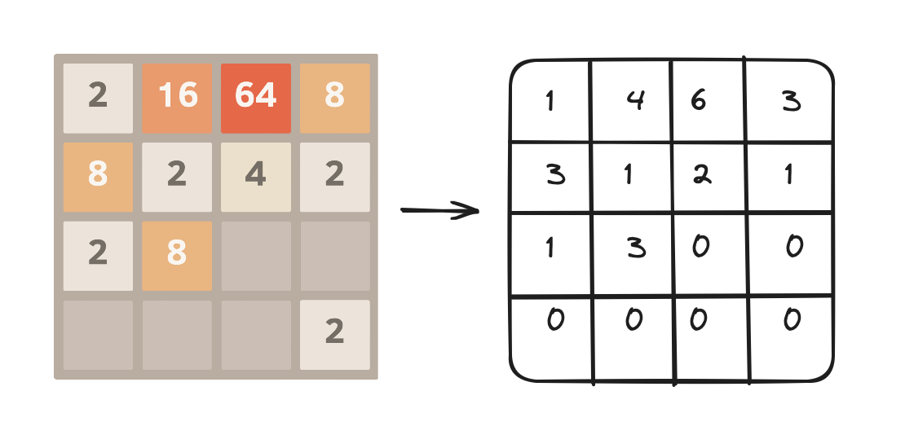
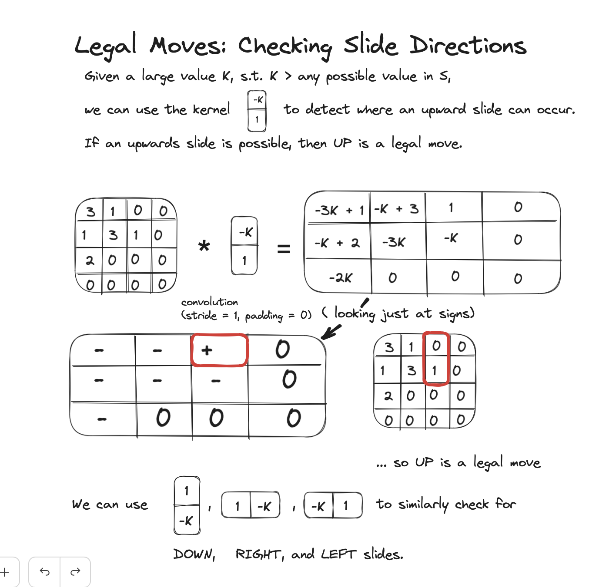
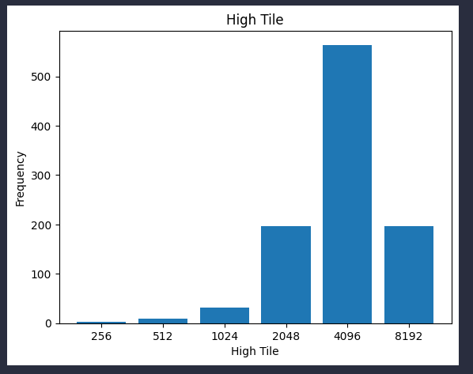
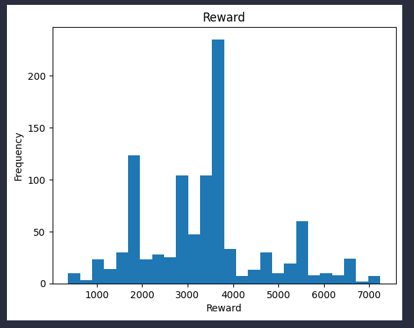
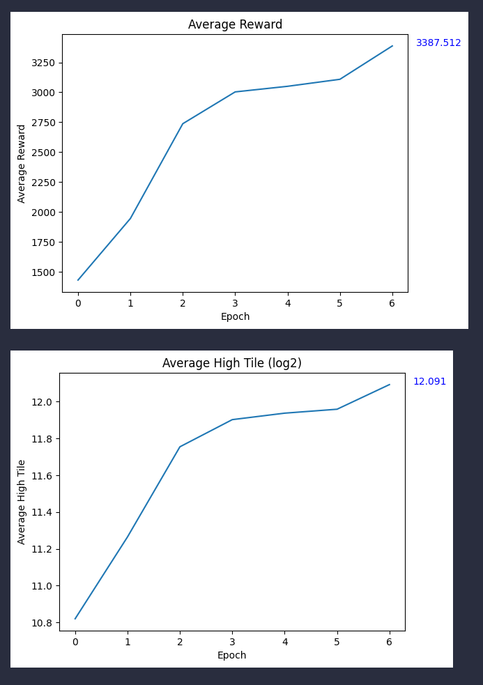

# 2048 Env
2048 is a sliding tile puzzle game where players attempt to acheive a high score via combining tiles efficiently. Tiles appear on the board after each move, so the player must take actions skillfully in order to acheive a good score.

Each turn:
* The player chooses a direction to push the tiles: Left, Right, Up, or Down
* A direction is legal if any existing tiles can slide in that direction, or if two tiles can combine in that direction
* After tiles have been moved/combined, a new tile (90% chance to be a 2, 10% chance to be a 4) appears in a random unoccupied position on the board
* While the stated goal of *2048* is to acheive the namesake *2048* tile, one could also pose the objective to be making as many moves as possible, or obtaining as high a tile as possible (perhaps even larger than 2048).

In addtion to the demo included in this project, you can play 2048 here: [play2048.co](https://play2048.co)

2048 may initially appear to be a trivial task for RL algorithms due to its small action and observation spaces, but beware! *2048* games often continue for several thousand steps, especially when played by a strong player, which is much more than traditional RL tasks such as Chess, Go, or Othello. This lengthy duration means training can be computationally expensive, even for smaller networks and less computationally expensive algorithms.

## Environment Specs
 |Item | Size | Notes |
 | --- | --- | --- |
 | Observation Size | 1x4x4 | 4x4 grid containing log2(tile value) | 
 | Policy Size | 1x4 | 4 possible actions (left, down, right, up) |

## Implementation Notes
### State Representation
I experimented with many different state representations, but found the best results by using a simple (1x4x4) representation, where each value in the 4x4 grid is represented by log2(tile value), i.e.:



I use 0 as a special value to signify an empty space (a tile with value 1 is impossible).

### Getting Legal Actions
There are 2 conditions that allow for an action to be legal:
1. Any tile is free to slide in the given direction
2. Any two identical tiles can combine in the given direction

All operations to detect these 2 conditions must be vectorized in order to support hardware acceleration and allow computation to be parallelized across many environments. 

To detect if any slides are legal, I use custom convolutional filters, that return a positive value when a slide is possible:



Given a kernel for each direction, a slide in a direction is legal if its convolution yields any positive value. This operation can be applied to many environments in parallel and is extremely fast on a GPU.

In code, this looks like the following:
```python
mask0 = torch.tensor([[[[-1e5, 1]]]], dtype=dtype, device=device, requires_grad=False)
mask1 = torch.tensor([[[[1], [-1e5]]]], dtype=dtype, device=device, requires_grad=False)
mask2 = torch.tensor([[[[1, -1e5]]]], dtype=dtype, device=device, requires_grad=False)
mask3 = torch.tensor([[[[-1e5], [1]]]], dtype=dtype, device=device, requires_grad=False)

m0 = torch.nn.functional.conv2d(states, mask0, padding=0, bias=None).view(n, 12)
m1 = torch.nn.functional.conv2d(states, mask1, padding=0, bias=None).view(n, 12)
m2 = torch.nn.functional.conv2d(states, mask2, padding=0, bias=None).view(n, 12)
m3 = torch.nn.functional.conv2d(states, mask3, padding=0, bias=None).view(n, 12)

# due to floating point error we check for values > 0.5 rather than values > 0
m0_valid = torch.any(m0 > 0.5, dim=1, keepdim=True) # LEFT VALID
m1_valid = torch.any(m1 > 0.5, dim=1, keepdim=True) # DOWN VALID
m2_valid = torch.any(m2 > 0.5, dim=1, keepdim=True) # RIGHT VALID
m3_valid = torch.any(m3 > 0.5, dim=1, keepdim=True) # UP VALID
```
Then, all that's left is to check for any possible merges. Note that while a merge resulting in a tile sliding first and then merging will not be detected by this technique, boards such as these will already be flagged as having a possible slide, so these cases are already accounted for when checking which moves are legal.

Checking for merges is trivial, just check for identical adjacent tiles vertically and horizontally. If any horizontal adjacent identical tiles are found, right and left slides are legal. If any vertical, up and down slides are legal.

```python
# Compute the differences between adjacent elements in the 2nd and 3rd dimensions
vertical_diff = states[:, :, :-1, :] - states[:, :, 1:, :]
horizontal_diff = states[:, :, :, :-1] - states[:, :, :, 1:]

# Check where the differences are zero, excluding the zero elements in the original matrix
vertical_zeros = torch.logical_and(vertical_diff == 0, states[:, :, 1:, :] != 0)
horizontal_zeros = torch.logical_and(horizontal_diff == 0, states[:, :, :, 1:] != 0)

# Flatten the last two dimensions and compute the logical OR along the last dimension
vertical_comparison = vertical_zeros.view(n, 12).any(dim=1, keepdim=True)
horizontal_comparison = horizontal_zeros.view(n, 12).any(dim=1, keepdim=True)
```
An action's legality can then be determined by logical OR-ing the two results:
```python
m0_valid.logical_or_(horizontal_comparison)
m2_valid.logical_or_(horizontal_comparison)
m1_valid.logical_or_(vertical_comparison)
m3_valid.logical_or_(vertical_comparison)
```
### Applying Actions
Once a legal action is chosen for each environment, tiles must slide and be merged in the action's direction. Rather than implement a set of vectorized operations that perform slides/merges in 4 different directions, it's simpler and faster to first rotate each board so that the direction of the necessary slides/merges are all the same. This leads to the following code:

```python
def push_actions(states, actions) -> torch.Tensor:
    rankt = torch.arange(4, 0, -1, device=states.device, requires_grad=False).expand((states.shape[0] * 4, 4))
    actions = actions.view(-1, 1, 1, 1).expand_as(states)  
    states = rotate_by_amnts(states, actions) # rotate according to action taken
    states = merge(states, rankt) # perform slides and merges 
    states = rotate_by_amnts(states, (4-actions) % 4) # rotate boards back into place
    return states
```
Let's choose to slide and merge all states to the left. This means that states where we are applying left shifts won't need to be rotated, but each other state will need to be rotated such that the desired operation is acheived by a LEFT (id=0) slide/merge. This is acheived by rotating 90 degrees clockwise for DOWN (id=1) actions, 180 degrees for RIGHT (id=2) actions, and 270 degrees for UP (id=3) actions. These rotations are applied selectively to each state:

```python
def rotate_by_amnts(states, amnts):
    mask1 = amnts == 1
    mask2 = amnts == 2
    mask3 = amnts == 3

    states[mask1] = states.flip(2).transpose(2, 3)[mask1]
    states[mask2] = states.flip(3).flip(2)[mask2]
    states[mask3] = states.flip(3).transpose(2, 3)[mask3]

    return states
```
Once states are rotated into place, slides and merges need to be applied. Since identical tiles merge even if there is initially an empty space between them, an accurate implementation first collapses (slides) tiles, then applies merges, then collapses tiles again -- merging tiles creates another empty space that can be occupied. According to the rules of 2048, merges are applied left to right and a merged tile may not merge again, so the collapse/merge/collapse algorithm is sufficient. 

The collapse operation can be implemented by a ranked sort, whereby nonzero tiles are sorted according to their rank (position from left to right).

```python
def collapse(rankt, bs_flat) -> torch.Tensor: 
    non_zero_mask = (bs_flat != 0)

    # Set the rank of zero elements to zero
    rank = (rankt * non_zero_mask)

    # Create a tensor of sorted indices by sorting the rank tensor along dim=-1
    sorted_indices = torch.argsort(rank, dim=-1, descending=True, stable=True)

    return torch.gather(bs_flat, dim=-1, index=sorted_indices)
```

Then, the merge operation locates identical, adjacent tiles and increments the left tile by one (one power of two) while zeroing the right tile:

```python
def merge(states, rankt) -> torch.Tensor:
    shape = states.shape
    bs_flat = states.view(-1, shape[-1])

    # Step 1: collapse (slide) tiles
    bs_flat = collapse(rankt, bs_flat)

    # Step 2: apply merge operation
    for i in range(3):
        is_same = torch.logical_and(bs_flat[:,i] == bs_flat[:,i+1], bs_flat[:,i] != 0)
        bs_flat[:,i].add_(is_same)
        bs_flat[:,i+1].masked_fill_(is_same, 0)

    # Step 3: collapse again
    bs_flat = collapse(rankt, bs_flat)

    return bs_flat.view(shape)
```
## Training Results
I chose to train a model using the LazyZero [link] algorithm for this environment. AlphaZero is ill-suited for 2048 because it does not account well for *2048*'s stochastic nature. Stochastic implementations of MCTS/AlphaZero/MuZero do exist, but I have not implemented them within this project yet. LazyZero performs exploration via policy-driven rollouts, so it implicitly accounts for any randomness in the environment, as it will be captured by the rollouts (albeit only strongly at shallower depths). When compared with stochastic AlphaZero or other RL algorithms, LazyZero is a weak algorithm. Nevertheless, it is able to achieve the 2048 tile 95% of the time after training a relatively small network. 

The trained network was configured with 6 residual blocks with 16 channels each, followed by policy and value heads containing 3 16-channel residual blocks and a final liner layer. This comes out to 72917 trainable parameters, a very small model by most standards.

```python
ResNetConfig(
    input_size=[1, 4, 4], 
    policy_size=4, 
    res_channels=16, 
    res_blocks=6, 
    value_head_res_channels=16, 
    value_head_res_blocks=3, 
    policy_head_res_channels=16, 
    policy_head_res_blocks=3, 
    kernel_size=3, 
    policy_fc_size=32, 
    value_fc_size=32, 
    value_output_activation=''
)
```
The full configuration file for training/evaluation this model can be found [here](link).

### Results
After 80,000 training episodes (8 epochs), the model acheived the 2048 tile in over 95% of evalution games, and acheived the 4096 tile or higher in over 75% of evaluation games. A total of 1000 evaluation games were played.



The reward distribution (reward = # of moves) during evaluation:



Evaluation performance improved drastically over the course of training:



Needless to say, a stronger, more sophisticated algorithm like stochastic AlphaZero would likely perform much better -- I plan on revisiting *2048* upon completion of a vectorized stochastic-MCTS implementation. 