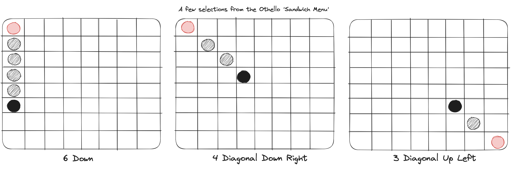
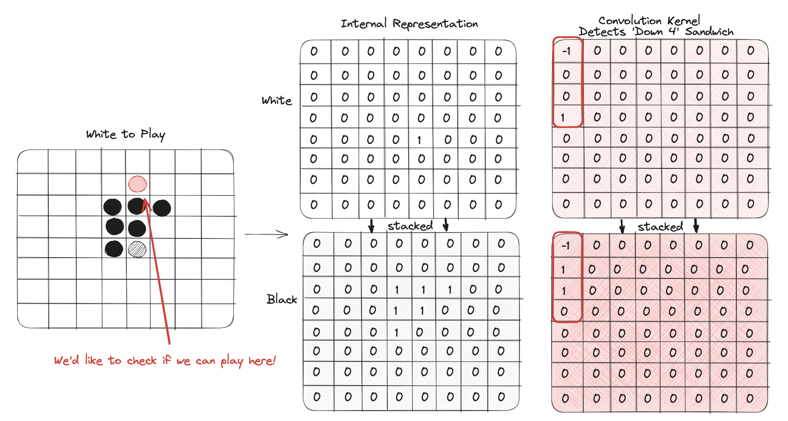

# Othello Env

Othello, also called Reversi, is a turn-based, 2-player game, usually played on an 8x8 board. One player plays with black pieces, and the other with white pieces. The game can be boiled down to a few basic rules:
 * Players take turns, placing a single piece on the board.
 * A placement is legal if there exists at least one straight (horizontal, vertical, or diagonal) occupied line of opposing pieces between the placed piece and another piece of the same color
 * The opposing pieces occupying that space are then flipped to the opposite color
 * If no placements are legal, the player skips their turn without placing a piece
 * If neither player can make a legal move, the game ends
 * If all tiles are occupied, the game ends
 * The winner is determined to be the player who has a higher number of pieces of their color on the board at the end of the game. If both players have the same number of pieces, the game is a draw.

For a full discussion of the rules and game mechanics, see [wikipedia](https://en.wikipedia.org/wiki/Reversi).

Due to its simplicity, Othello has become a trendy proving ground for RL algorithms. A few selected works include:
 * 

## Environment Specs
 |Item | Size | Notes |
 | --- | --- | --- |
 | Observation Size | 2x8x8 | 2 players, 8x8 one-hot encoding of tiles per player | 
 | Policy Size | 1x65 | 64 possible tile placements + 1 null action |

## Implementation Notes
 Internally, an othello board is represented as 2x8x8 one-hot tensor, where the first dimension encodes the player (player 1 or player 2), and the second and third dimensions encode the (*x,y*) coordinates of each player's tiles.

 In order to vectorize the Othello environment, a few tricks are necessary. These involve two main operations: generating legal actions, and applying a move to the board. Because these two operations often happen one after the other, we can be clever and avoid repeating work as well.

 Keep in mind that in order to vectorize the environment, we need to write every operation that can be applied to the game state as a series of multi-dimensional matrix operations! This means we'll be manipulating PyTorch tensors, and will allow us to utilize the power of GPUs to greatly accelerate environment computation and therefore immensely accelerate model training.
### Generating legal actions
 For an action to be legal, it must make a 'sandwich' of the opponet's tiles between two of the current player's own tiles. On the starting board, this means the following actions are available (shown in red, black to play):


 Our task really boils down to checking if placing our tile on a certain square is legal, looking for any 'sandwiches'. Then we can apply this algorithm to each of the 64 squares, we'll just want to make sure it's vectorizable.

 To acheive this, we'll actually borrow a technique from elsewhere in ML: convolutions! I'm quite fond of convolutions for vectorizing tasks like these. 
 
 If you wanted to implement an *Othello* game to play against your friends in your browser, you might take a different, more efficient approach. You might iteratively check neighboring tiles in each direction from the square in question, with conditional logic to find *sandwiches* and logic to break out of the iteration once you do. However, keeping in mind we want to run thousands of these environments on the GPU in parallel, conditional logic local to a single environment is off the table -- it means we'd have to apply that logic to each environment sequentially and even linear runtime is *not* acceptable here (*doesn't it feel great to say that?*).

 Anyways, back to convolutions. One observation to make is that in our 8x8 *Othello* gridworld, there are a finite number of *sandwiches*. To be more precise, given any square, we know that we could *sandwich* an opponet's tile in any of the 8 (4 diagonal, 2 horizontal, 2 vertical) directions, and our sandwich can contain at most *6* opponet tiles given the size of the board. This gives us 48 distinct sandwiches (a menu!).

 We can represent each *sandwich* as a matrix:
 
 
 Then, we just need to represent each of these matrices in such a way, such that when they are convolved with the board states representation (discussed above), they 'detect' where a given sandwich is found. We can visualize such a kernel:



In this example, we know that the red highlighed square is a legal action, so let's see how the kernel shown above detects it, this time with PyTorch!

```python
    board = torch.tensor([[[
        [0, 0, 0, 0, 0, 0, 0, 0],
        [0, 0, 0, 0, 0, 0, 0, 0],
        [0, 0, 0, 0, 0, 0, 0, 0],
        [0, 0, 0, 0, 0, 0, 0, 0],
        [0, 0, 0, 0, 1, 0, 0, 0],
        [0, 0, 0, 0, 0, 0, 0, 0],
        [0, 0, 0, 0, 0, 0, 0, 0],
        [0, 0, 0, 0, 0, 0, 0, 0],
    ],[
        [0, 0, 0, 0, 0, 0, 0, 0],
        [0, 0, 0, 0, 0, 0, 0, 0],
        [0, 0, 0, 1, 1, 1, 0, 0],
        [0, 0, 0, 1, 1, 0, 0, 0],
        [0, 0, 0, 1, 0, 0, 0, 0],
        [0, 0, 0, 0, 0, 0, 0, 0],
        [0, 0, 0, 0, 0, 0, 0, 0],
        [0, 0, 0, 0, 0, 0, 0, 0],
    ]]])

    kernel = torch.tensor([[[
        [-1, 0, 0, 0, 0, 0, 0, 0],
        [0, 0, 0, 0, 0, 0, 0, 0],
        [0, 0, 0, 0, 0, 0, 0, 0],
        [1, 0, 0, 0, 0, 0, 0, 0],
        [0, 0, 0, 0, 0, 0, 0, 0],
        [0, 0, 0, 0, 0, 0, 0, 0],
        [0, 0, 0, 0, 0, 0, 0, 0],
        [0, 0, 0, 0, 0, 0, 0, 0],
    ],[
        [-1, 0, 0, 0, 0, 0, 0, 0],
        [1, 0, 0, 0, 0, 0, 0, 0],
        [1, 0, 0, 0, 0, 0, 0, 0],
        [0, 0, 0, 0, 0, 0, 0, 0],
        [0, 0, 0, 0, 0, 0, 0, 0],
        [0, 0, 0, 0, 0, 0, 0, 0],
        [0, 0, 0, 0, 0, 0, 0, 0],
        [0, 0, 0, 0, 0, 0, 0, 0],
    ]]])

    torch.nn.functional.conv2d(board, kernel, padding=7, bias=None)
```
```python
    tensor([[[
          [ 0,  0,  0,  0,  0,  0,  0,  0,  0,  0,  0,  0,  0,  0,  0],
          [ 0,  0,  0,  0,  0,  0,  0,  0,  0,  0,  0,  0,  0,  0,  0],
          [ 0,  0,  0,  0,  0,  0,  0,  0,  0,  0,  0,  0,  0,  0,  0],
          [ 0,  0,  0,  0,  0,  0,  0,  0,  0,  0,  0,  0,  0,  0,  0],
          [ 0,  0,  0,  0,  0,  0,  0,  0,  0,  0,  0,  0,  0,  0,  0],
          [ 0,  0,  0,  0,  0,  0,  0,  0,  0,  0,  0,  0,  0,  0,  0],
          [ 0,  0,  0,  0,  0,  0,  0,  0,  0,  0,  0,  0,  0,  0,  0],
          [ 0,  0,  0,  0,  0,  0,  0,  0,  0,  0,  1,  1,  1,  0,  0],
          [ 0,  0,  0,  0,  0,  0,  0,  0,  0,  0,  2,  3,  1,  0,  0],
          [ 0,  0,  0,  0,  0,  0,  0,  0,  0,  0,  1,  0, -1,  0,  0],
          [ 0,  0,  0,  0,  0,  0,  0,  0,  0,  0,  0, -1,  0,  0,  0],
          [ 0,  0,  0,  0,  0,  0,  0,  0,  0,  0, -1, -1,  0,  0,  0],
          [ 0,  0,  0,  0,  0,  0,  0,  0,  0,  0,  0,  0,  0,  0,  0],
          [ 0,  0,  0,  0,  0,  0,  0,  0,  0,  0,  0,  0,  0,  0,  0],
          [ 0,  0,  0,  0,  0,  0,  0,  0,  0,  0,  0,  0,  0,  0,  0]
    ]]])
```

As you can see, we get a bunch of values as the result of our convolution. If you read the code, you'll see that I assign 'magic numbers' to each convolution, which is simply the value that will be present when the particular *sandwich* is possible on a given square. In this case, our magic number is 3 (it's just *sandwich length - 1*). Note that we must add some padding (board size - 1) to these convolutions, so that we can check every possible *sandwich* for a given square, even if an irrelevant part of the convolutional kernel is 'out of bounds'. There is some additional code that maps these convolution results back to their respective squares, which I won't discuss here.

Given *N* parallel environments, when we convolve the full kernel (48 *sandwiches* x 2 x 8 x 8) with the vectorized game state (*N* x 2 x 8 x 8) and padding=7, the result is an (*N* x 48 x 15 x 15) tensor, which we can carefully map back to an (*N* x 48 x 8 x 8) tensor s.t. convolutions map properly back to board coordinates. We can compare this to our magic numbers, and get a boolean (*N* x 48 x 8 x 8) where a value is true if the corresponding *sandwich* in the game and grid space is possible. Then, calculating legal moves is as simple as checking if any of the 48 values for a particular board space and game are True.

This can be neatly done with the following code (bl_idx, br_idx, tl_idx, tr_idx help us map back to the appropriate squares):
```python 
    def get_legal_actions(states, ray_tensor, legal_actions, filters, bl_idx, br_idx, tl_idx, tr_idx, ct):
        board_size = int(states.shape[-1]) 
        conv_results = torch.nn.functional.conv2d(states, filters, padding=board_size-1, bias=None)
        ray_tensor.zero_()
        ray_tensor[:, tl_idx] = conv_results[:, tl_idx, board_size-1:, board_size-1:]
        ray_tensor[:, tr_idx] = conv_results[:, tr_idx, board_size-1:, :-(board_size-1)]
        ray_tensor[:, bl_idx] = conv_results[:, bl_idx, :-(board_size-1), board_size-1:]
        ray_tensor[:, br_idx] = conv_results[:, br_idx, :-(board_size-1), :-(board_size-1)]
        ray_tensor[:] = (ray_tensor.round() == ct).float()
        legal_actions.zero_()
        legal_actions[:,:board_size**2] = ray_tensor.any(dim=1).view(-1, board_size ** 2)
        legal_actions[:,board_size**2] = ~(legal_actions.any(dim=1))
        return legal_actions
```
This approach would be crazy for a single-threaded application, and likely much slower than an algorithm a typical undergrad might come up with for a homework assignment. However, when we scale up to thousands of environments and take advantage of hardware-acceleration via GPUs, the speedups acheived with this vectorized approach are immense, as we can scale up at the cost of insignificant additional runtime. 

[GRAPH OF SCALING GOES HERE!]

(ok, no, GPUs do not allow you to scale infinitely, in my experience running this environment on an A100 operations per second begin to scale linearly between 10k and 20k parallel environments, ymmv)

### Applying actions to the game state
 Great, we generated legal actions, and hopefully our algorithm picked some good ones. The next task is to apply those actions to the board, which mostly involves flipping the other player's captured pieces to the current player's color. Once again, we'd like to do this to matrix operations that we can apply to each and every board at once, no local conditional logic. Assuming we just checked for legal actions, we can actually re-use some of the work we've done before. 

 We already calculated each valid ray for each square on the board, before was picked. If we still had access to the (*N* x 48 x 8 x 8) ray tensor, we could simply flip all of the activated rays. Since in many cases we check for legal actions and then make a move, we can cache the ray tensor used when calculating legal actions, and use it again to know which values to flip. If not, we can simply calculate it again.

## Training Results